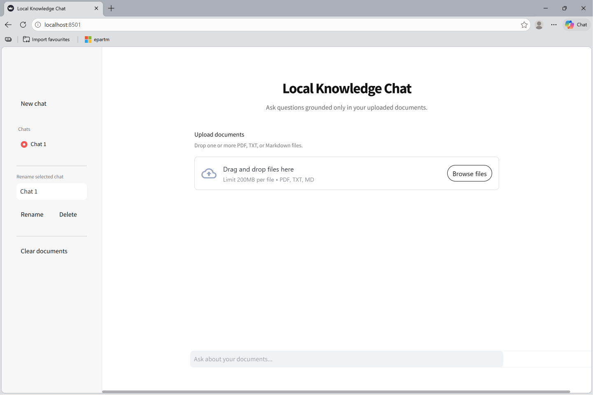
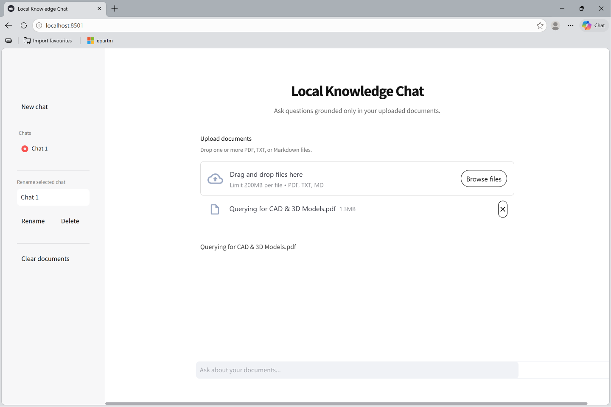
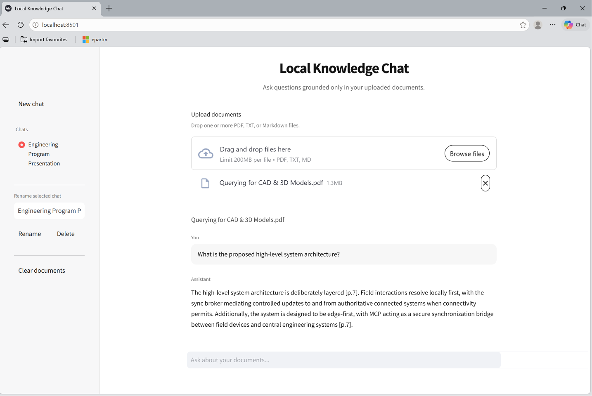
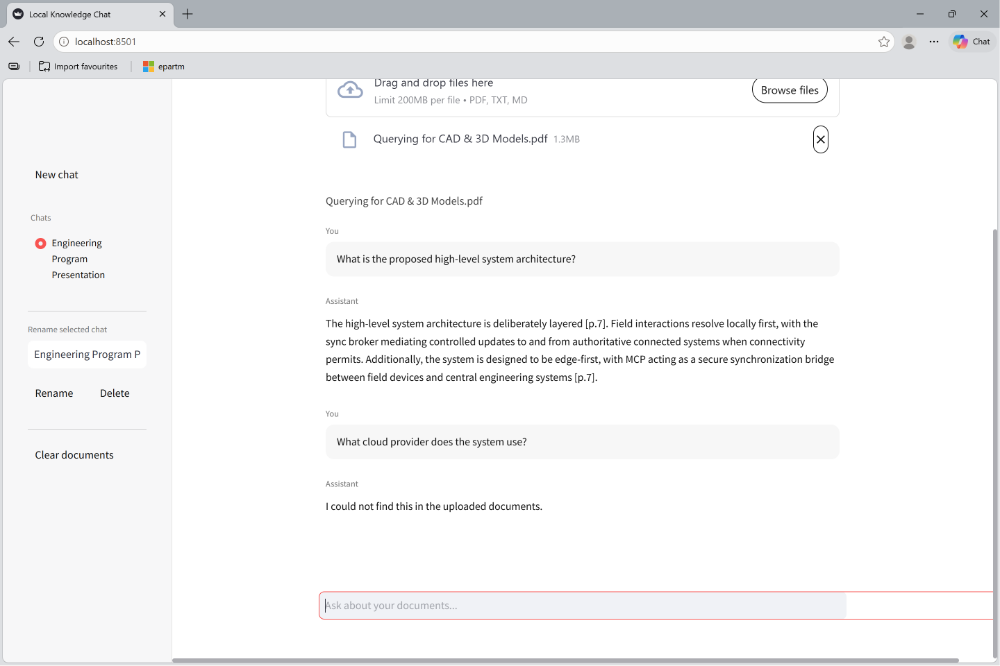

# Local RAG Knowledge Platform

A local-first AI knowledge assistant for uploading documents, indexing them locally, and asking grounded questions through a private Retrieval-Augmented Generation pipeline.

This project is designed as a production-style GitHub portfolio project for AI/backend engineering roles. It demonstrates document ingestion, semantic search, local embeddings, vector databases, local LLM orchestration, FastAPI backend design, Streamlit UI development, Dockerisation, configuration handling, and hallucination-aware answer generation.

## Features

- Upload multiple PDF, TXT, and Markdown documents
- Extract and chunk document text locally
- Generate embeddings locally with `sentence-transformers`
- Store document vectors locally using ChromaDB
- Ask questions grounded only in uploaded documents
- Query a local LLM through Ollama
- Return concise, source-grounded answers with page citations
- ChatGPT-style multi-chat interface
- Rename, delete, and create chat sessions
- Clear uploaded documents and reset the vector index
- FastAPI backend with OpenAPI docs
- Docker and Docker Compose support
- Environment-based configuration
- Basic tests and CI structure

## Screenshots

### Landing Page

### Document Upload

### Grounded AI Response

### Hallucination Guardrails

## Why This Project Matters

Most simple AI portfolio projects depend on paid APIs and hide the real engineering tradeoffs.

This project is different because it is:

- Fully local-first
- Free to run
- Private by design
- Built with modular backend architecture
- Designed around real RAG engineering constraints
- Optimised for low-resource local inference
- Structured like a startup SaaS backend rather than a tutorial clone

During development, the system was tested against real local hardware constraints, including model size, RAM usage, retrieval quality, hallucination control, and response latency.

## Tech Stack

| Area | Technology |
|---|---|
| Backend API | FastAPI |
| Frontend | Streamlit |
| Local LLM | Ollama |
| Embeddings | sentence-transformers |
| Vector Database | ChromaDB |
| PDF Parsing | PyMuPDF |
| Testing | Pytest |
| Containerisation | Docker Compose |
| Configuration | pydantic-settings |

## Architecture

User
 ↓
Streamlit Chat UI
 ↓
FastAPI Backend
 ↓
Document Upload Service
 ↓
Text Extraction
 ↓
Chunking Pipeline
 ↓
Local Embedding Model
 ↓
ChromaDB Vector Store
 ↓
Semantic Retriever
 ↓
Prompt Builder
 ↓
Ollama Local LLM
 ↓
Grounded Answer with Citations
